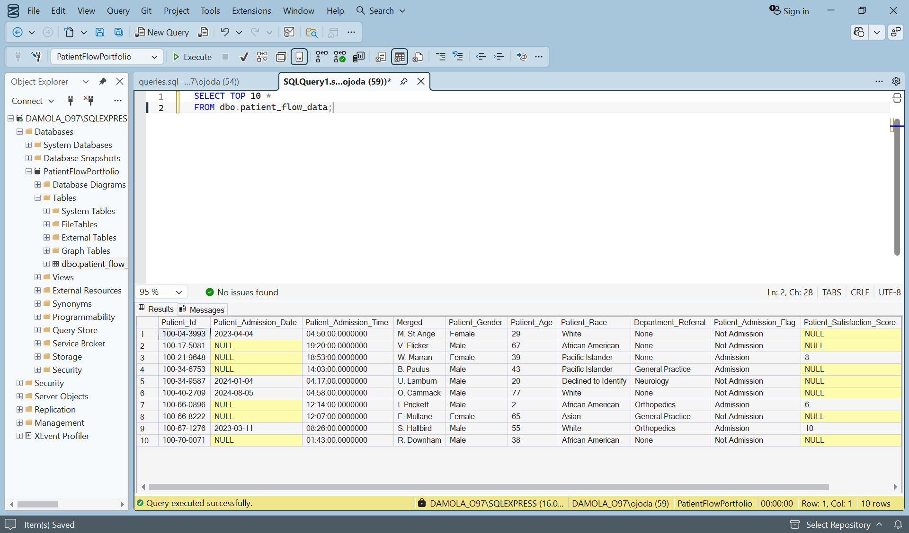
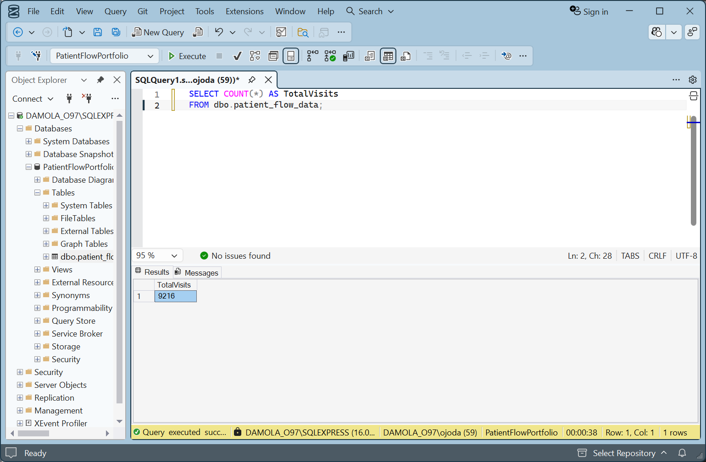
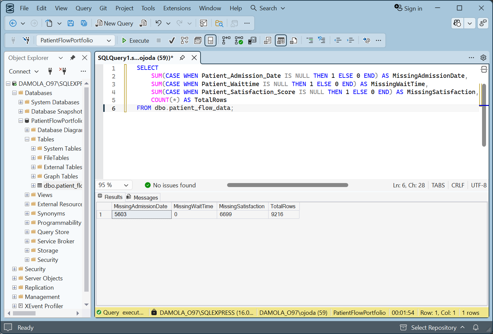
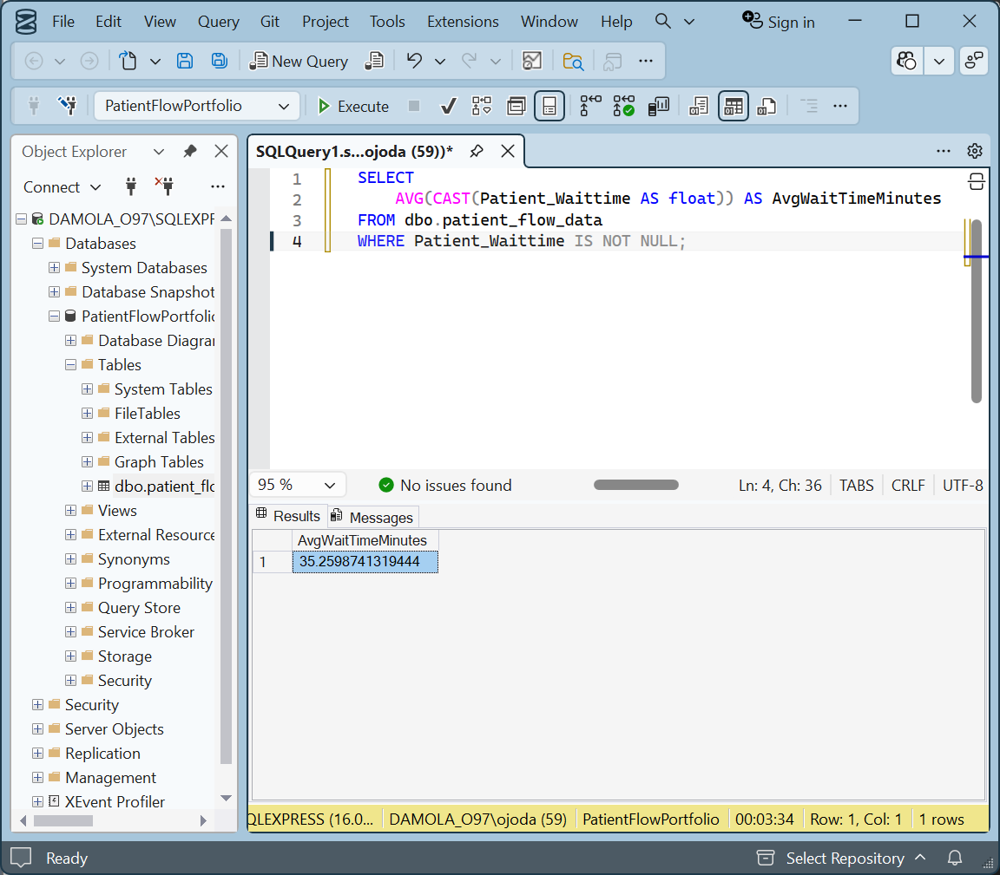
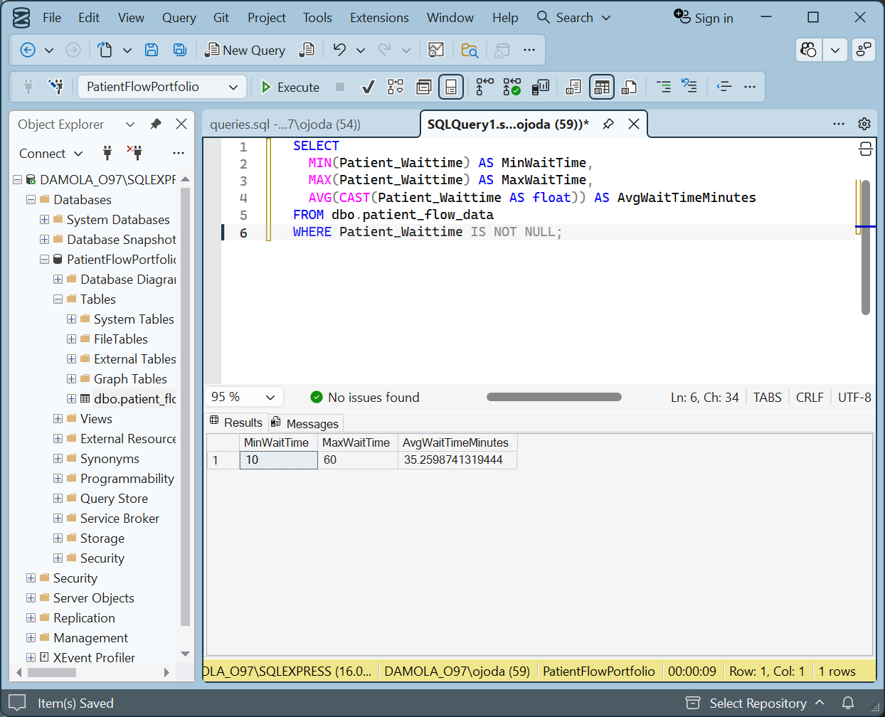
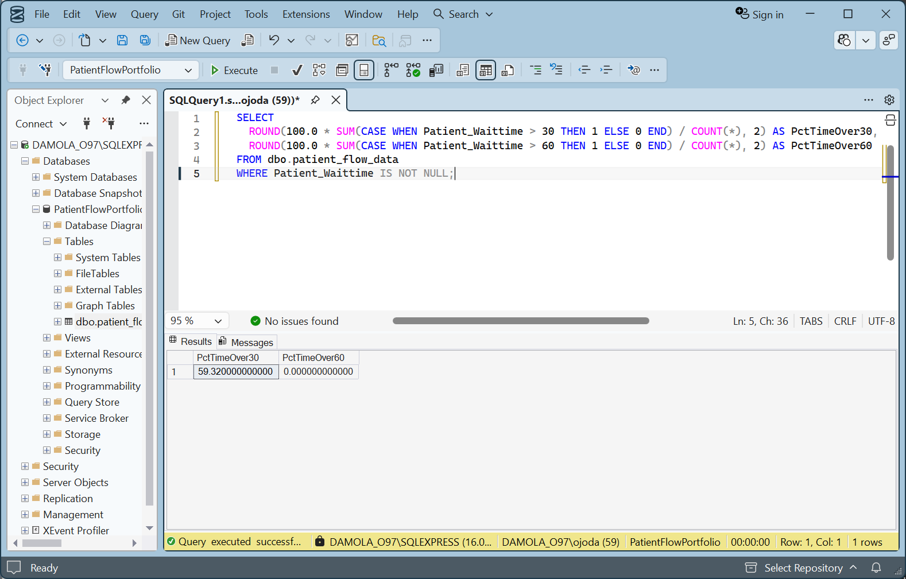
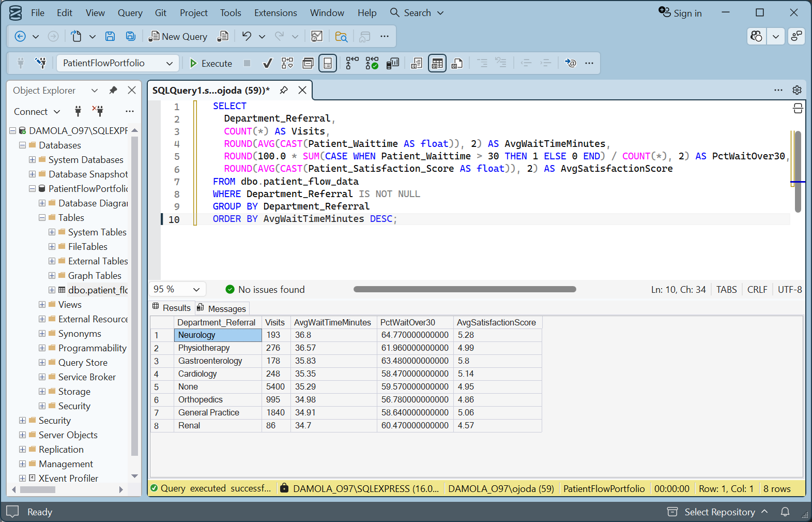
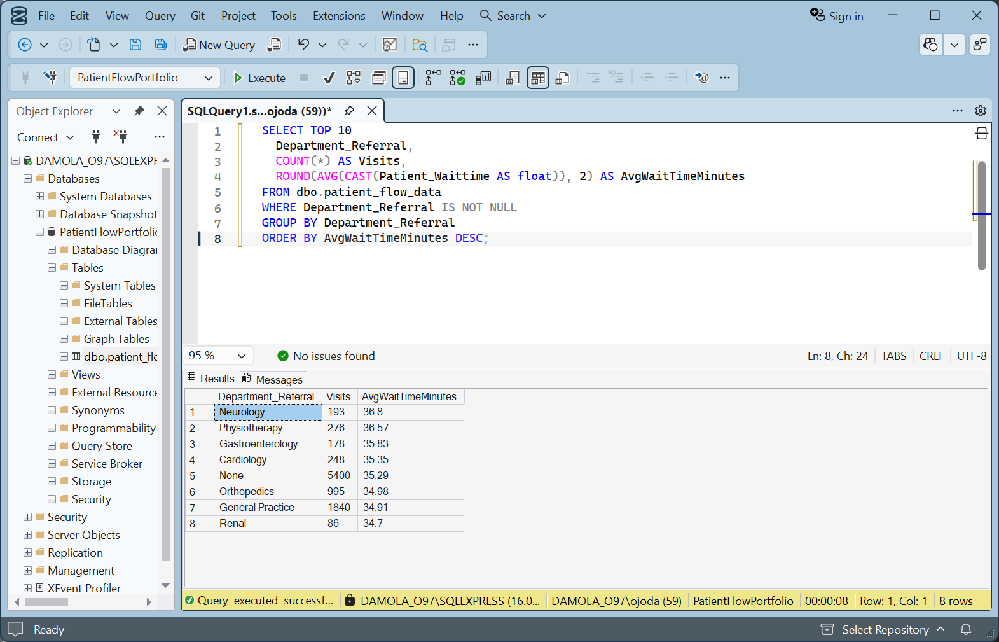
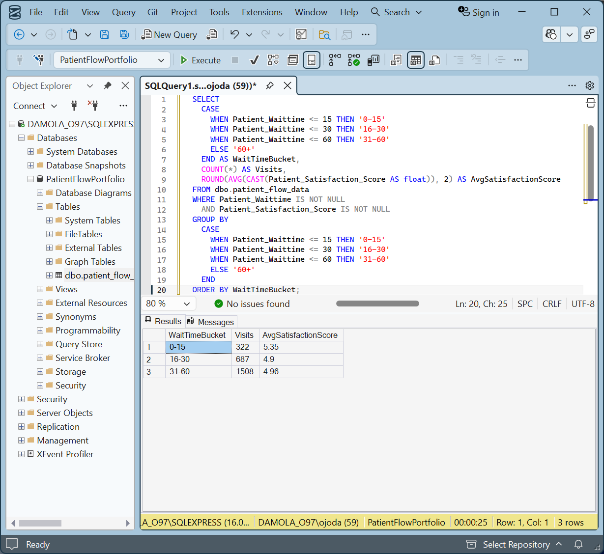
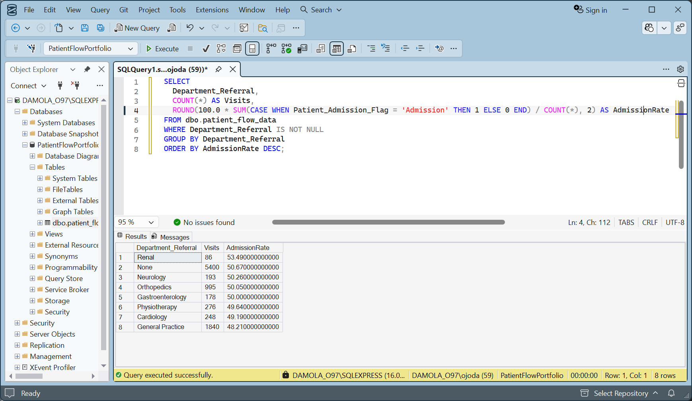

# Project: Patient Flow Quality Measures (SQL)
An SQL project focused on patient flow quality measures (wait time, satisfaction, admissions, department KPIs) using SQL Server/SSMS.

**Tools**: SQL Server (SSMS).

**Dataset**: dbo.patient_flow_data (9,216 visits).

## Skills Demonstrated
- SQL aggregations (COUNT, AVG), filtering (WHERE), and sorting (ORDER BY).
- Conditional logic (CASE WHEN) for KPI thresholds and wait-time bucketing.
- Grouped KPI reporting (GROUP BY) at the department level.
- Basic data quality checks.

## Objective
To analyze patient flow data to evaluate quality measures related to:
- access (wait times),
- patient experience (satisfaction),
- operations (department bottlenecks),
- utilization proxy (admission rates).

## Key Data Quality Notes
**Total visits**: 9,216.

**Missing admission dates**: 5,603 (handled by allowing NULLs).

**Missing satisfaction scores**: 6,699.

**Wait time completeness**: 0 missing.

## KPIs (Quality Measures)
- **Average wait time**: 35.26 minutes.
- **Wait time range**: 10–60 minutes.
- **% of visits with wait time > 30 minutes**: 59.32%.
- **% of visits with wait time > 60 minutes**: 0% (max wait capped at 60).
- Department-Level Performance.

## KPI Table by Department
Created a KPI table by department showing:
- total visits.
- avg wait time.
- % wait > 30.
- avg satisfaction score.

## Findings (Highlights)
- **A high wait-time burden**: ~59.32% of visits exceeded 30 minutes.
- **Satisfaction is highest for shorter waits**: The 0–15 min wait bucket averaged 5.35, compared with 4.90–4.96 for longer wait times.
- **Operational bottlenecks exist at the department level**: The Neurology and Physiotherapy departments had the highest avg wait times in this sample (~36–37 minutes).
- **Data quality improvement opportunity**: “None” appears as a Department_Referral category, indicating uncategorized referrals that should be standardized for a more accurate reporting.

Note: Satisfaction scores are missing for many visits in this dataset, which is common in real-world settings (survey response/capture is often incomplete). Satisfaction-related metrics are calculated using available responses only.

## Next Steps
- Standardize `Department_Referral` values (e.g., treat "None" responses as "Unknown") to improve department reporting accuracy.
- Add time-based analysis (hour/day patterns) using valid admission dates.
- Build a lightweight dashboard (Power BI/Tableau) using the SQL outputs for executive reporting.

## Files
queries.sql – SQL reporting pack (KPIs, department KPIs, satisfaction buckets, admissions).

/screenshots – outputs from query results.

### Screenshots
1. Data preview  

2. Total visits  

3. Missing data  

4. Average wait time  

5. Wait time range validation  

6. % waits over 30/60  

7. Department KPIs  

8. Top bottleneck departments  

9. Satisfaction vs wait time  

10. Admission rate by department  

